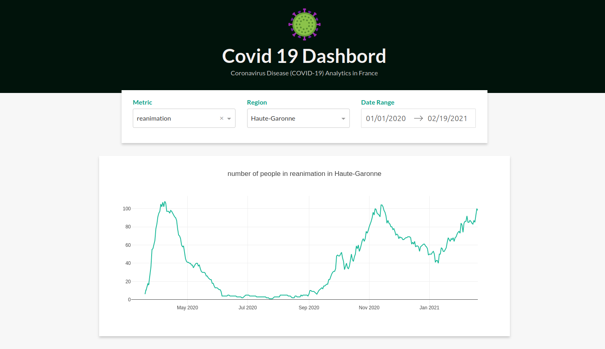
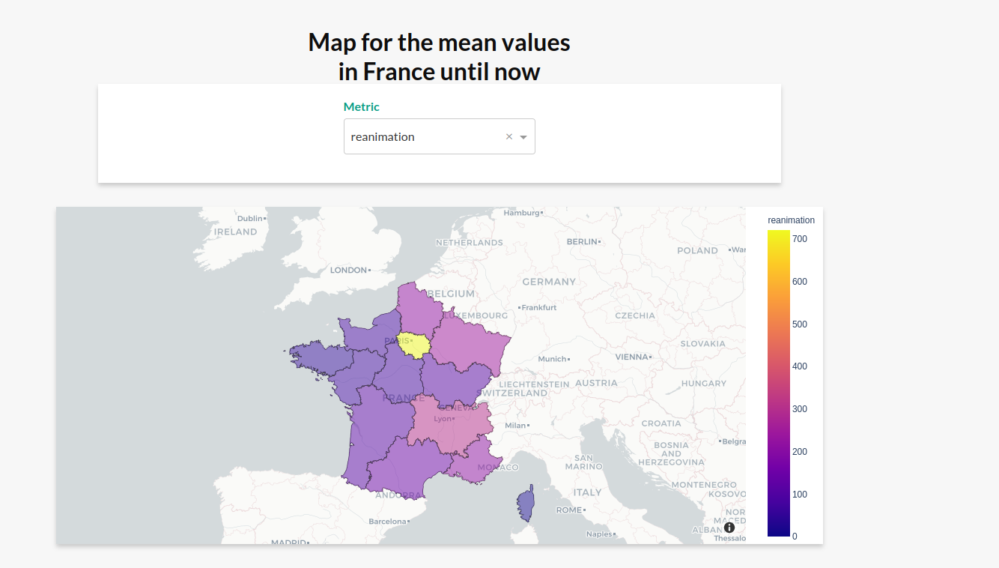

# Covid19-DashBord
A dashbord for covid 19 data analytics in France 

  
     

 
## Table of contents
* [General info](#general-info)
* [Technologies](#technologies)
* Next step

## General info
The DashBord is deployed on Heroku , feel free to check it here https://app-covid-dash.herokuapp.com/	(The map takes few seconds to load)\
The France regions geojson file is from this repository https://github.com/gregoiredavid/france-geojson \
The data is retrieved from https://github.com/opencovid19-fr/data 
## Technologies
Project is created with:
* Python version 3.8
* Dash \
A python framework te create interactive dashbords. 
* Plotly \
A librarie to make cool plots including maps
* HTML and CSS \
To make the web page format and style
* pandas \
 To process  the data 
* Heroku \
To deploy the app 

	
## Next step
make the dashbord go live 
